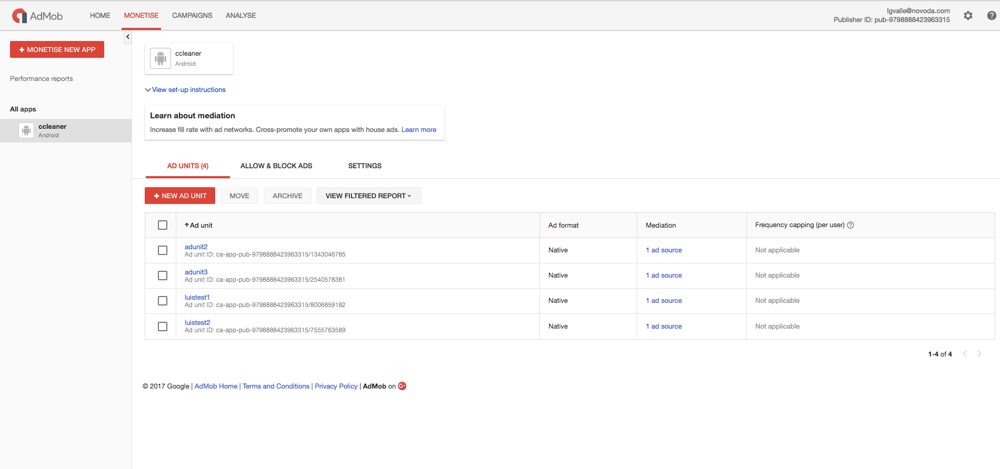
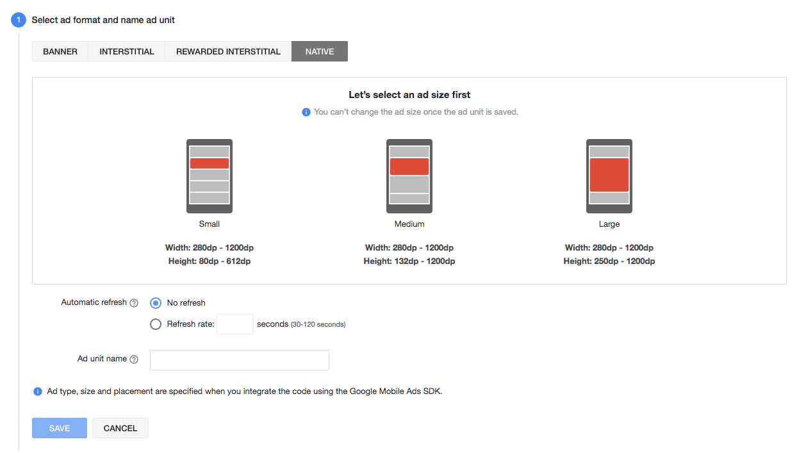
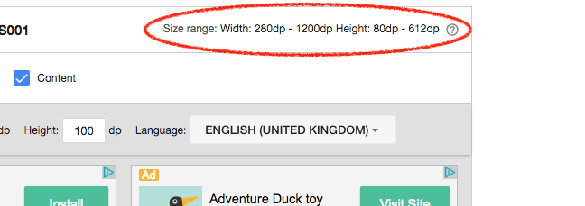

# Native Ads Express

[Native Ad Express](https://firebase.google.com/docs/admob/android/native-express) are similar to regular ads in the way you add them to your layout, but you can customise the look & feel using CSS in the [AdMob console](https://apps.admob.com)


## 1. Creating the ad unit in admob.com

First step is to create an ad unit in your admob console.



Select native ads and choose a size template: small, medium or large.



## 2. Adding a native express add:

In your layout, just add:

```xml
<com.google.android.gms.ads.NativeExpressAdView
    android:id="@+id/adView"
    android:layout_width="wrap_content"
    android:layout_height="wrap_content"
    ads:adUnitId="ca-app-123123123123/123123123"
    ads:adSize="320x150">
</com.google.android.gms.ads.NativeExpressAdView>
```

* `adUnitId`: You get this ID from your AdMob console
* `adSize`: This is tricky. You can't specify `BANNER_SMART` to make it automatically adjust like in regular ads. Instead you need to provide a fixed size. Although is possible to make the width dynamic using `FULL_WIDTH`

```xml
ads:adSize="FULL_WIDTHx150"
```

It is possible to preview how the ad would look given a size in the admob console. But you *can't* specify the sizes you'd like to work with. That is given when you select the native ad template in the first step.



There is a table in the documentation summarising available sizes

> A publisher who wants to display a medium template size can use widths between 280 and 1200 dp and heights from 132 to 1200 dp. That means that 300 by 200, 450 by 150, and 613 by 572 are all valid for the medium template size. Bear in mind, though, that not all sizes are likely to make for a good presentation. While it's technically possible to request a small template with a size of 1200 by 80, it's probably not the best choice! Also, be sure to consider the screen dimensions of the device on which you're displaying the ad. Larger sizes should generally be reserved for presentation on tablets.


## 3. Loading  a native express add:

The process is the same as loading a regular ad:

####1. In the activity, initialise MobileAds:

```
MobileAds.initialize(getApplicationContext(), getString(R.string.ad_app_id));
```

####2. Load the view and build a request:

```
NativeExpressAdView mAdView = (NativeExpressAdView) findViewById(R.id.adViewExpress);
AdRequest adRequest = new AdRequest.Builder().build();
mAdView.loadAd(adRequest);
```

To test on the emulator or local device you need to build the request specifying a test device id (you will see an error on the logs with your device id if you don't do it)

```
AdRequest adRequest = new AdRequest.Builder()
        .addTestDevice("8618D8DA6DCD4458BB73B2E86F071849")
        .addTestDevice("08F56DB244F8E9BFC78FA1DD9D427A5A")
        .build();
mAdView.loadAd(adRequest);
```
